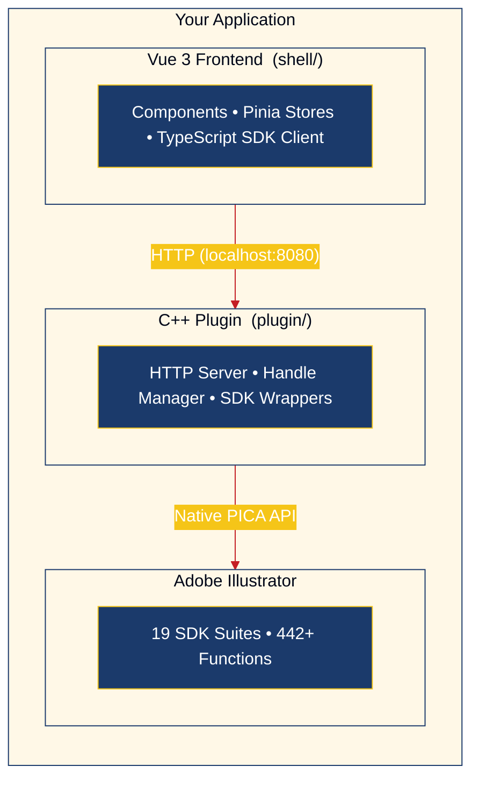

# NUXP ("Not UXP")

<p align="center">
  
</p>

<p align="center">
  
  
  
  
</p>

**A modern plugin framework for Adobe Illustrator.**

UXP has transformed plugin development for Photoshop, InDesign, and other Adobe apps — but it hasn't arrived for Illustrator yet. In the meantime, the only official option is CEP, which was deprecated in 2013 and hasn't seen meaningful updates since.

**NUXP** bridges that gap. It lets you build Illustrator plugins using **Vue**, **TypeScript**, and the **Adobe C++ SDK**, giving you a modern development experience today.

## Why NUXP?

<p align="center">
  
</p>

Illustrator developers have been waiting for UXP support for years. Roadmap slides, developer previews, "coming soon" — but no shipping product. Meanwhile, CEP's embedded Chromium browser and ExtendScript runtime make plugin development feel stuck in 2013.

NUXP takes a different approach. Instead of an embedded browser panel, it runs a local HTTP server inside a C++ plugin and communicates with a standalone frontend. You get direct SDK access, modern tooling, hot reload, and a development workflow that matches how we build software today.

## Architecture

NUXP replaces the "CEP Panel" approach with a standalone web application that communicates with Illustrator via a C++ plugin exposing a local HTTP server.



For details on threading, handle management, and code generation, see [Architecture](docs/ARCHITECTURE.md).

## Current Capabilities

NUXP auto-generates typed C++ and TypeScript bindings for the Illustrator SDK. The code generator parses SDK headers with tree-sitter, classifies parameter types, and produces complete HTTP/JSON wrappers.

### SDK Coverage

**442 functions** across **19 suites**, with 100% routing of all parsed functions:

| Suite | Functions | Description |
|-------|-----------|-------------|
| AIArtSuite | 72 | Core art object manipulation |
| AIDocumentSuite | 68 | Document management |
| AIArtboardSuite | 40 | Artboard properties and layout |
| AILayerSuite | 39 | Layer management |
| AIDictionarySuite | 36 | Dictionary (metadata) access |
| AIToolSuite | 32 | Tool management |
| AIEntrySuite | 23 | Dictionary entry read/write |
| AIBlendStyleSuite | 23 | Opacity, blending modes |
| AIUserSuite | 20 | User interaction, dialogs |
| AIArtSetSuite | 16 | Art set operations |
| AIUndoSuite | 16 | Undo/redo transactions |
| AIMaskSuite | 15 | Clipping mask operations |
| AILayerListSuite | 12 | Layer list traversal |
| AITimerSuite | 8 | Timer callbacks |
| AIAppContextSuite | 7 | Application context |
| AINotifierSuite | 5 | Event notifications |
| AIMdMemorySuite | 5 | Memory management |
| AIGroupSuite | 4 | Group operations |
| AITransformArtSuite | 1 | Transform operations |

### Type System

The code generator handles these C++ type categories automatically:

| Category | Examples | Marshaling |
|----------|----------|------------|
| **Handles** (18 types) | AIArtHandle, AILayerHandle, AIDictionaryRef | Integer IDs via HandleRegistry |
| **Managed Handles** (2 types) | ai::ArtboardProperties, ai::ArtboardList | Owned via ManagedHandleRegistry |
| **Primitives** (10+ types) | AIBoolean, AIReal, ai::int32, size_t | Direct JSON mapping |
| **Strings** (3 types) | ai::UnicodeString, const char*, ai::FilePath | UTF-8 string conversion |
| **Structs** (3 types) | AIRealRect, AIRealPoint, AIRealMatrix | Nested JSON objects |
| **Enums** | AIEntryType, ai::ArtboardID | Integer cast |
| **Non-standard returns** | AIReal, AIArtHandle, const char* | Direct value or handle registration |

### What Requires Hand-Written Wrappers

Some SDK patterns can't be auto-generated and need manual C++ endpoints:

- **Complex structs** - AIColor (tagged union), AIPathStyle (nested structs), AIGradient
- **Callback functions** - Plugin infrastructure callbacks
- **Array parameters** - AIPathSegment[], triple pointers (AIArtHandle***)
- **Text (ATE)** - Adobe Text Engine headers have SDK conflicts

The infrastructure makes adding manual wrappers straightforward. See `plugin/src/endpoints/` for examples.

### Real-Time Events

Server-Sent Events push Illustrator state changes to the frontend in real-time:
- Document open/close/switch
- Selection changes
- Layer modifications
- Art creation/deletion

### Additional Code Generators

Beyond SDK suite wrappers, NUXP includes:

- **Custom Route Generator** - Define HTTP endpoints in JSON, get type-safe C++ handlers + TypeScript clients. Supports path parameters, request/response schemas, and config inheritance.
- **SSE Event Generator** - Define events in JSON, get C++ emitters + TypeScript event bus with typed payloads.

## Quick Start

### Prerequisites

- **Node.js** v18+
- **CMake** v3.15+ (for building the C++ plugin)
- **C++ Compiler**: Xcode Command Line Tools (macOS) or Visual Studio 2022 (Windows)
- **Adobe Illustrator** 2024+ (for running the plugin)
- **Adobe Illustrator SDK** (see below)

### 1. Clone and Install Dependencies

```bash
git clone https://github.com/your-org/nuxp.git
cd nuxp

# Install codegen dependencies
cd codegen && npm install && cd ..

# Install shell (frontend) dependencies
cd shell && npm install && cd ..
```

### 2. Run in Development Mode (No Illustrator Required)

The shell includes a mock bridge that simulates the C++ plugin, allowing frontend development without Illustrator:

```bash
cd shell
VITE_USE_MOCK=true npm run dev
```

Open http://localhost:5173 to see the debug panel and design system demo.

### 3. Build with Real Illustrator Integration

#### a. Download the Adobe Illustrator SDK

> **Note**: The SDK is proprietary and cannot be included in this repository. You must download it from Adobe (requires free Adobe account).

1. Go to **[Adobe Illustrator SDK Download](https://developer.adobe.com/console/servicesandapis/ai)**
2. Sign in with your Adobe ID
3. Download the **Illustrator 2026 SDK** (or matching your Illustrator version)
4. You'll get a `.dmg` file (macOS) or `.zip` file (Windows)

#### b. Setup the SDK

**macOS:**
```bash
# Run the setup script with your downloaded DMG
./scripts/setup-sdk.sh ~/Downloads/AI_2026_SDK_Mac.dmg
```

**Windows:**
```bash
# Extract the ZIP to plugin/sdk/ manually, then:
# Ensure these directories exist:
#   plugin/sdk/AIArt.h (and other headers)
#   plugin/sdk/SPFiles.h (PICA headers)
```

The setup script extracts and organizes:
- Illustrator API headers
- PICA/Sweet Pea headers (platform types)
- ATE (Adobe Text Engine) headers
- Creates `IllustratorSDK.h` convenience header

#### c. Generate SDK Wrappers (Optional)

```bash
./scripts/generate.sh
```

This parses SDK headers and generates:
- C++ endpoint handlers -> `plugin/src/endpoints/generated/`
- TypeScript SDK client -> `shell/src/sdk/generated/`

#### d. Build the C++ Plugin

```bash
cd plugin
cmake -B build
cmake --build build
```

Or with Xcode:
```bash
cd plugin
cmake -B build-xcode -G Xcode
cmake --build build-xcode --config Release
```

> **macOS Note**: NUXP's CMake build automatically configures the bundle metadata required by Illustrator (`CFBundlePackageType=ARPI`, `CFBundleSignature=ART5`). If your plugin doesn't load, see [Troubleshooting](#troubleshooting) below.

**Customizing the Plugin Name:**

You can customize your plugin's identity when configuring CMake:

```bash
cmake -B build \
  -DPLUGIN_NAME="MyPlugin" \
  -DPLUGIN_DISPLAY_NAME="My Awesome Plugin" \
  -DPLUGIN_VERSION="1.0.0" \
  -DPLUGIN_BUNDLE_ID="com.mycompany.illustrator.myplugin"
```

Or use CMake presets (see `plugin/CMakePresets.json`):

```bash
cmake --preset custom-example
cmake --build build
```

| Variable | Default | Description |
|----------|---------|-------------|
| `PLUGIN_NAME` | `NUXPPlugin` | File name (no spaces) |
| `PLUGIN_DISPLAY_NAME` | `NUXP` | Name shown in Illustrator |
| `PLUGIN_VERSION` | `1.0.0` | Semantic version |
| `PLUGIN_BUNDLE_ID` | `com.nuxp.illustrator.plugin` | macOS bundle identifier |

#### e. Install the Plugin

```bash
cmake --install build
```

Or manually copy to your Illustrator plugins folder:
- **macOS**: `~/Library/Application Support/Adobe/Adobe Illustrator 2024/Plug-ins/`
- **Windows**: `C:\Program Files\Adobe\Adobe Illustrator 2024\Plug-ins\`

#### f. Run the Frontend

```bash
cd shell
npm run dev
```

With Illustrator running and the plugin loaded, the frontend will connect to the real SDK.

## Project Structure

```
nuxp/
├── plugin/                 # C++ Illustrator plugin
│   ├── CMakeLists.txt
│   ├── sdk/                # Adobe SDK headers (gitignored, you provide)
│   ├── lib/                # Third-party deps (httplib.h, json.hpp)
│   └── src/
│       ├── Plugin.cpp      # Entry point
│       ├── HttpServer.cpp  # Local HTTP server (cpp-httplib)
│       ├── HandleManager.* # Thread-safe handle registries (18 types)
│       ├── HandleRegistry.hpp        # Non-owning handle template
│       ├── ManagedHandleRegistry.hpp # Owning handle template (RAII)
│       ├── MainThreadDispatch.*      # SDK call queuing to main thread
│       ├── SSE.*           # Server-Sent Events
│       ├── utils/          # Color, Document, Geometry, Layer, Selection, String utils
│       └── endpoints/      # HTTP endpoint handlers
│           ├── *.cpp       # Hand-written endpoints
│           └── generated/  # Auto-generated (19 suites, 442 functions)
│
├── shell/                  # Vue 3 frontend
│   ├── src/
│   │   ├── components/     # Vue components
│   │   ├── services/       # API client, MockBridge
│   │   ├── sdk/            # TypeScript SDK bindings (generated + bridge)
│   │   ├── stores/         # Pinia state management
│   │   └── views/          # Page components
│   └── package.json
│
├── codegen/                # SDK header parser & code generator
│   ├── src/
│   │   ├── parser/         # Tree-sitter based header parser
│   │   ├── generator/      # CppGenerator, TypeScriptGenerator,
│   │   │                   # SSEGenerator, CustomRouteGenerator
│   │   └── config/         # type-map.json, routes.json, events.json
│   └── package.json
│
├── scripts/
│   └── generate.sh         # Run codegen and copy outputs
│
└── docs/
    └── getting-started.md  # Detailed setup guide
```

## Development Workflows

### Frontend Development (Mock Mode)

For rapid UI iteration without Illustrator:

```bash
cd shell
VITE_USE_MOCK=true npm run dev
```

The mock bridge provides simulated responses for all SDK calls.

### Full Stack Development

1. Start Illustrator with the plugin loaded
2. Run the frontend: `cd shell && npm run dev`
3. Changes to Vue components hot-reload automatically

### Extending the SDK

To add support for new Illustrator SDK features:

1. **Automatic** (recommended): Add headers to the SDK and run `./scripts/generate.sh`
2. **Manual**: Create custom endpoint handlers in `plugin/src/endpoints/`

### Code Generator Tests

```bash
cd codegen
npm test                    # all 346 tests
npm test -- --testPathPattern="CppGenerator"  # single suite
```

## API Overview

The TypeScript SDK provides three calling patterns, depending on how the endpoint was created.

### 1. Generated Suite Functions (auto-generated from SDK headers)

Each Illustrator SDK suite gets a typed module with one function per method. Use these when the SDK function you need has been auto-generated:

```typescript
import { GetArtType, GetArtBounds, GetArtName } from '@/sdk/generated/AIArtSuite'

const artType = await GetArtType(handleId)         // returns number
const bounds  = await GetArtBounds(handleId)        // returns AIRealRect
const info    = await GetArtName(handleId)          // returns { name, isDefaultName }
```

These call `callCpp` internally and route through the `CentralDispatcher` on the C++ side.

### 2. Custom Route Functions (hand-written endpoints)

Complex operations that cannot be auto-generated (path styles, text frames, selection queries, XMP metadata) are defined in `codegen/src/config/routes.json` and exposed as typed functions:

```typescript
import { GetDocumentInfo, GetViewZoom, QueryPathItems } from '@/sdk/generated/customRoutes'
import { GetSelection, GetPathStyle, CreateTextFrame } from '@/sdk/generated/customRoutes'

const doc   = await GetDocumentInfo()       // returns { name, path, saved, artboards }
const zoom  = await GetViewZoom()           // returns { zoom }
const paths = await QueryPathItems()        // returns { items, count }
const sel   = await GetSelection()          // returns { handles, count }
const style = await GetPathStyle(String(handleId))  // returns fill/stroke details
const text  = await CreateTextFrame({ x: 100, y: -200 })  // returns { success, artId }
```

Custom routes hit dedicated HTTP endpoints (e.g., `GET /api/doc/info`, `GET /api/selection`) rather than the central dispatcher.

### 3. Generic Bridge Call (flexible, for ad-hoc use)

Use `callCpp` directly when you want maximum flexibility or are prototyping:

```typescript
import { callCpp } from '@/sdk/bridge'

const result = await callCpp<{ type: number }>('AIArtSuite', 'GetArtType', { art: handleId })
const bounds = await callCpp<{ bounds: AIRealRect }>('AIArtSuite', 'GetArtBounds', { art: handleId })
```

**When to use which pattern:**
- **Generated suite functions** -- best for standard SDK operations; fully typed, one function per SDK method
- **Custom route functions** -- best for complex operations (path styles, queries, text, XMP) that need hand-written C++ logic
- **Generic bridge call** -- best for prototyping or when you need to call a suite dynamically

## Creating Your Own Plugin

NUXP is designed as a foundation for building your own Illustrator plugins. Here's how to customize it for your project:

### 1. Plugin Identity

Configure your plugin's name and branding when building:

```bash
cd plugin
cmake -B build \
  -DPLUGIN_NAME="AcmeTools" \
  -DPLUGIN_DISPLAY_NAME="Acme Design Tools" \
  -DPLUGIN_VERSION="1.0.0" \
  -DPLUGIN_BUNDLE_ID="com.acme.illustrator.tools" \
  -DPLUGIN_AUTHOR="Acme Inc." \
  -DPLUGIN_DESCRIPTION="Professional design tools for Illustrator"
cmake --build build
```

| Option | Description | Example |
|--------|-------------|---------|
| `PLUGIN_NAME` | Output filename (no spaces) | `AcmeTools` |
| `PLUGIN_DISPLAY_NAME` | Name in Illustrator UI | `Acme Design Tools` |
| `PLUGIN_VERSION` | Semantic version | `1.0.0` |
| `PLUGIN_BUNDLE_ID` | macOS identifier | `com.acme.illustrator.tools` |
| `PLUGIN_AUTHOR` | Your name/company | `Acme Inc.` |

For persistent configuration, create `plugin/CMakeUserPresets.json`:

```json
{
  "version": 6,
  "configurePresets": [{
    "name": "my-plugin",
    "inherits": "default",
    "cacheVariables": {
      "PLUGIN_NAME": "AcmeTools",
      "PLUGIN_DISPLAY_NAME": "Acme Design Tools",
      "PLUGIN_BUNDLE_ID": "com.acme.illustrator.tools"
    }
  }]
}
```

Then build with: `cmake --preset my-plugin && cmake --build build`

### 2. Frontend Branding

Update `shell/index.html` and `shell/src/App.vue` with your branding. The Tauri configuration in `shell/src-tauri/tauri.conf.json` controls the desktop app name and window title.

### 3. Adding Custom Endpoints

Create new SDK bindings in `plugin/src/endpoints/`:

```cpp
// plugin/src/endpoints/MyFeatureEndpoints.cpp
void RegisterMyFeatureEndpoints(httplib::Server& server) {
    server.Post("/api/my-feature/do-something", [](const auto& req, auto& res) {
        // Your SDK code here
        res.set_content("{\"success\": true}", "application/json");
    });
}
```

Register in `plugin/src/endpoints/RegisterAll.cpp` and add corresponding TypeScript types in `shell/src/sdk/`.

See [Adding Custom Endpoints](docs/ADDING-ENDPOINTS.md) for a step-by-step guide and [Endpoint Organization](plugin/src/endpoints/README.md) for the generated vs. hand-written code boundary.

### 4. Adding Custom Routes via Code Generation

For type-safe route generation, define endpoints in `codegen/src/config/routes.json`:

```json
{
  "namespace": "MyApp",
  "routes": [
    {
      "name": "GetWidgetInfo",
      "method": "GET",
      "path": "/api/widget/:id",
      "pathParams": [{ "name": "id", "description": "Widget ID" }],
      "response": [
        { "name": "name", "type": "string" },
        { "name": "count", "type": "number" }
      ]
    }
  ]
}
```

Run `npm run generate` to produce matching C++ handlers and TypeScript clients.

## Using NUXP as a Library

If you want to keep NUXP as a separate upstream dependency (rather than forking), you can link against NUXP's core infrastructure from your own project. This allows you to:

- Pull in NUXP updates without merge conflicts
- Keep your plugin code separate from NUXP infrastructure
- Contribute fixes back to NUXP easily

### Project Structure

```
your-workspace/
├── nuxp/                    # Clone of NUXP (upstream)
│   └── plugin/
└── your-plugin/             # Your project
    ├── CMakeLists.txt
    ├── plugin/
    │   └── src/
    │       ├── YourPlugin.cpp       # Your plugin entry point
    │       └── endpoints/           # Your endpoint handlers
    └── frontend/                    # Your frontend (optional)
```

### CMakeLists.txt Example

```cmake
cmake_minimum_required(VERSION 3.20)
project(YourPlugin VERSION 1.0.0 LANGUAGES CXX)

set(CMAKE_CXX_STANDARD 17)
set(CMAKE_CXX_STANDARD_REQUIRED ON)

# Include NUXP's core infrastructure
# This provides: HttpServer, SSE, SuitePointers, HandleManager, utils
add_subdirectory(${CMAKE_CURRENT_SOURCE_DIR}/../nuxp/plugin nuxp-build)

# Your plugin sources
set(YOUR_SOURCES
    src/YourPlugin.cpp
    src/endpoints/FeatureOneEndpoints.cpp
    src/endpoints/FeatureTwoEndpoints.cpp
)

# Create your plugin
add_library(YourPlugin SHARED ${YOUR_SOURCES})

# Link NUXP core infrastructure
target_link_libraries(YourPlugin PRIVATE nuxp-core)

# Add YOUR Adobe SDK location (NUXP doesn't provide this)
set(AI_SDK_PATH "${CMAKE_CURRENT_SOURCE_DIR}/sdk")
target_include_directories(YourPlugin PRIVATE
    ${AI_SDK_PATH}
    ${CMAKE_CURRENT_SOURCE_DIR}/src
)

# Platform-specific settings (see NUXP's CMakeLists.txt for full example)
if(APPLE)
    set_target_properties(YourPlugin PROPERTIES
        BUNDLE TRUE
        BUNDLE_EXTENSION "aip"
        MACOSX_BUNDLE TRUE
    )
    target_compile_definitions(YourPlugin PRIVATE MAC_ENV)
    target_link_libraries(YourPlugin PRIVATE
        "-framework CoreFoundation"
        "-framework Cocoa"
    )
endif()
```

### What NUXP Core Provides

When you link against `nuxp-core`, you get:

| Component | Description |
|-----------|-------------|
| `HttpServer` | Background HTTP server with CORS and path parameter routing |
| `SSE` | Server-Sent Events for real-time push notifications |
| `MainThreadDispatch` | Safe SDK calls from HTTP thread |
| `SuitePointers` | Adobe SDK suite acquisition |
| `HandleManager` | Thread-safe handle lifecycle management (18 handle types + 2 managed) |
| `StringUtils` | String conversion utilities |
| `ColorUtils` | Color manipulation helpers |
| `GeometryUtils` | Geometry and transform utilities |
| `LayerUtils` | Layer management helpers |
| `DocumentUtils` | Document operations |
| `SelectionUtils` | Selection handling |

### What You Provide

Your project must provide:

- **Adobe SDK headers** - Download from Adobe, add to your include paths
- **Plugin entry point** - Your own `Plugin.cpp` with `StartupPlugin()`, `ShutdownPlugin()`, etc.
- **Endpoint handlers** - Your feature-specific HTTP endpoints
- **Route registration** - Call your handlers from `HttpServer::ConfigureRoutes()`

### Example Plugin Entry Point

```cpp
// YourPlugin.cpp
#include "SuitePointers.hpp"
#include "HttpServer.hpp"
#include "SSE.hpp"

extern "C" SPBasicSuite* sSPBasic;

ASErr StartupPlugin(SPInterfaceMessage* message) {
    sSPBasic = message->d.basic;

    // Initialize NUXP infrastructure
    SuitePointers::Acquire();
    HttpServer::Start(8080);

    return kNoErr;
}

ASErr ShutdownPlugin(SPInterfaceMessage* message) {
    HttpServer::Stop();
    SuitePointers::Release();
    return kNoErr;
}

// ... other plugin callbacks
```

### Workflow

1. **Clone NUXP** alongside your project
2. **Create your CMakeLists.txt** referencing NUXP via `add_subdirectory()`
3. **Write your plugin code** using NUXP's infrastructure
4. **Find a bug in NUXP?** Fix it in the nuxp/ folder, commit, push upstream
5. **Pull NUXP updates** with `git pull` in the nuxp/ folder

## Building for Production

### Frontend

```bash
cd shell
npm run build
```

Output: `shell/dist/`

### Plugin

```bash
cd plugin
cmake -B build -DCMAKE_BUILD_TYPE=Release
cmake --build build --config Release
```

## CI/CD

GitHub Actions workflows are included for:
- Building the C++ plugin (macOS + Windows)
- Building the Vue frontend
- Running codegen tests

Set the `ILLUSTRATOR_SDK_URL` secret to a URL where the SDK can be downloaded.

## Contributing

1. Fork the repository
2. Create a feature branch
3. Run tests: `cd codegen && npm test`
4. Submit a pull request

## Troubleshooting

### macOS: Plugin Not Loading (Silent Failure)

> **Adobe's Undocumented Bundle Requirements**
>
> Illustrator **silently ignores** plugins that don't have the correct bundle metadata.
> No error message, no log entry - the plugin simply won't appear. These settings are
> **not documented** in Adobe's SDK but are **absolutely required**:
>
> | Info.plist Key | Required Value | Wrong Value (won't load) |
> |----------------|----------------|--------------------------|
> | `CFBundlePackageType` | `ARPI` | `BNDL`, `APPL` |
> | `CFBundleSignature` | `ART5` | `????` |

If your plugin builds but doesn't load:

1. **Check Info.plist values**: Open `YourPlugin.aip/Contents/Info.plist` and verify:
   - `CFBundlePackageType` is `ARPI` (Adobe Resource Plug-In)
   - `CFBundleSignature` is `ART5` (Illustrator's signature)

2. **Check PIPL resource exists**: The plugin needs a compiled PIPL resource:
   ```bash
   ls YourPlugin.aip/Contents/Resources/pipl/plugin.pipl
   ```

3. **Verify PIPL contents** (optional):
   ```bash
   DeRez -only 'PiPL' YourPlugin.aip/Contents/Resources/pipl/plugin.pipl
   ```

NUXP's CMake build automatically sets the correct values via `Info.plist.in`. If you're using Xcode directly or creating custom Info.plist files, ensure these values are correct.

See [`plugin/mac/README.md`](plugin/mac/README.md) for detailed macOS build troubleshooting.

## License

MIT

---

*NUXP is not affiliated with or endorsed by Adobe. Adobe, Illustrator, and related marks are trademarks of Adobe Inc.*
