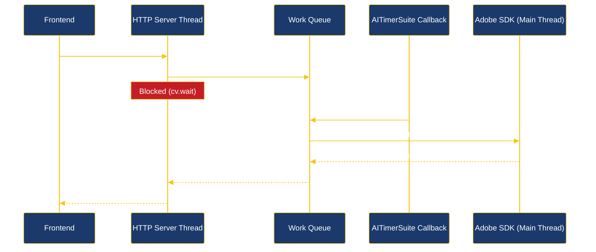
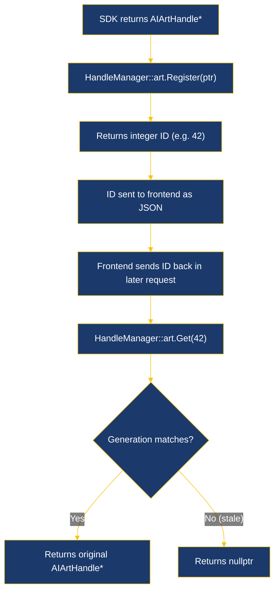
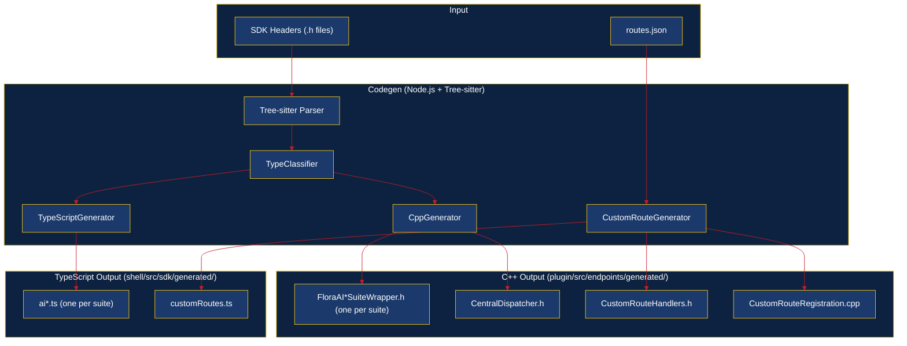
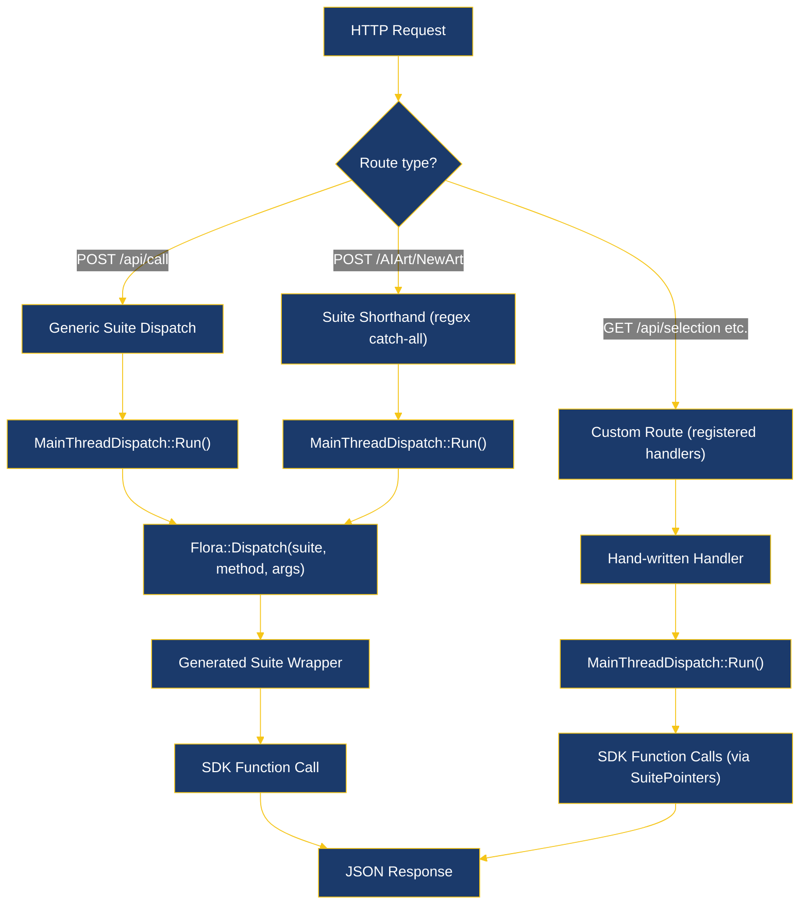

# NUXP Architecture

NUXP bridges a Vue/TypeScript frontend to Adobe Illustrator's C++ SDK via an HTTP/JSON server embedded in the plugin. The frontend (Tauri desktop app or dev server) sends HTTP requests to `localhost:8080`. The C++ plugin, loaded as a `.aip` file inside Illustrator, runs an embedded HTTP server that translates JSON requests into SDK calls and returns JSON responses.

```
Vue/TypeScript Frontend  <--HTTP/JSON-->  C++ Plugin (.aip)  <--PICA Suites-->  Adobe Illustrator
```

---

## 1. Threading Model

This is the most important concept in NUXP. Get this wrong and Illustrator will crash.

**Two threads are in play:**

| Thread | Role |
|--------|------|
| **HTTP server thread** | Background `std::thread` running cpp-httplib. Receives all HTTP requests. |
| **Illustrator main thread** | The only thread where Adobe SDK calls are permitted. Runs the plugin's timer callback. |

Adobe Illustrator's SDK is not thread-safe. Every suite function pointer (`SuitePointers::AIArt()`, `SuitePointers::AIDocument()`, etc.) must be called from Illustrator's main thread. The HTTP server runs on a background thread. `MainThreadDispatch` bridges the gap.

### How MainThreadDispatch Works

1. An HTTP request arrives on the server thread.
2. The handler calls `MainThreadDispatch::Run(lambda)`, which creates a `WorkItem`, pushes it onto a thread-safe queue, and blocks (via `condition_variable::wait`).
3. On the main thread, `AITimerSuite` fires a periodic callback (~16ms). `ProcessQueue()` drains all pending work items, executing each lambda on the main thread.
4. When a `WorkItem` completes, its `condition_variable` is notified, unblocking the server thread.
5. The handler receives the result and sends the HTTP response.



### Real Example from NUXPHandlers.cpp

Every handler follows this pattern -- wrap SDK calls inside `MainThreadDispatch::Run()`:

```cpp
std::string HandleGetSelection() {
    json result = MainThreadDispatch::Run([]() -> json {
        // --- This lambda runs on Illustrator's main thread ---
        AIArtHandle** matches = nullptr;
        ai::int32 numMatches = 0;

        ASErr err = SuitePointers::AIMatchingArt()->GetSelectedArt(
            &matches, &numMatches);
        if (err != kNoErr) {
            return {{"success", false}, {"error", "GetSelectedArt failed"}};
        }

        json handles = json::array();
        for (ai::int32 i = 0; i < numMatches; ++i) {
            handles.push_back(HandleManager::art.Register((*matches)[i]));
        }

        SuitePointers::AIMdMemory()->MdMemoryDisposeHandle(
            reinterpret_cast<AIMdMemoryHandle>(matches));

        return {{"success", true}, {"handles", handles}};
    });
    return result.dump();
}
```

There is also `RunWithTimeout()` for cases where you want to avoid blocking indefinitely:

```cpp
auto result = MainThreadDispatch::RunWithTimeout([&]() -> json {
    return callSdkFunction();
}, std::chrono::seconds(5));
// result is std::optional<json> -- empty if timeout
```

> **WARNING**: Every custom endpoint handler **must** wrap SDK calls in `MainThreadDispatch::Run()`. Calling SDK functions directly from an HTTP handler will crash Illustrator. There are no exceptions to this rule.

### Timeout Safety

`WorkItem` uses `shared_ptr` for its mutex, condition variable, and result. If a timeout occurs and the HTTP handler returns early, the main thread can still safely execute the lambda and write to the result without accessing freed memory.

---

## 2. Handle Management

C++ pointers like `AIArtHandle` (which is `ArtObject*`) cannot be serialized as JSON. The frontend needs a way to reference Illustrator objects across HTTP requests.

`HandleRegistry<T>` solves this by assigning stable integer IDs to raw pointers.



### HandleRegistry Internals

```cpp
template <typename T>
class HandleRegistry {
    struct Entry {
        T* ptr;
        uint32_t generation;  // generation when registered
    };
    std::unordered_map<int32_t, Entry> entries_;
    int32_t nextId_ = 1;      // 0 is reserved for null
    uint32_t generation_ = 0;
    // ...
};
```

Key behaviors:

- **Register**: Assigns a new integer ID (monotonically increasing, never reused). Thread-safe via `shared_mutex`.
- **Get**: Returns the pointer only if the entry's generation matches the current generation. Returns `nullptr` for stale handles.
- **BumpGeneration**: Increments the generation counter and clears all entries. Called on document switch, undo, redo, or document close.

### Pre-built Registries

`HandleManager` provides typed registries for every handle type the SDK uses:

```cpp
class HandleManager {
public:
    static HandleRegistry<ArtObject> art;           // AIArtHandle
    static HandleRegistry<_t_AILayerOpaque> layers;  // AILayerHandle
    static HandleRegistry<_t_AIDocument> documents;  // AIDocumentHandle
    static HandleRegistry<void> patterns;            // AIPatternHandle (void*)
    static HandleRegistry<void> gradients;           // AIGradientHandle (void*)
    // ... plus masks, tools, timers, dictionaries, artStyles, etc.

    static void InvalidateAll();  // BumpGeneration on all registries
};
```

### Usage Pattern

Register on the main thread (inside `MainThreadDispatch::Run`), send the ID to the frontend:

```cpp
// Registering
int32_t id = HandleManager::art.Register(artHandle);
responseJson["handle"] = id;

// Later, looking up
AIArtHandle art = HandleManager::art.Get(id);
if (!art) {
    return {{"success", false}, {"error", "Invalid or stale art handle"}};
}
```

---

## 3. Code Generation Pipeline

NUXP auto-generates C++ wrappers and TypeScript clients from Adobe's SDK headers. This avoids writing boilerplate for each of the hundreds of SDK functions.



### Step by Step

1. **Parse**: Tree-sitter walks SDK C headers and extracts `SuiteInfo` JSON -- suite names, function signatures, parameter types.

2. **Classify**: `TypeClassifier` categorizes each parameter:
   - **Handle** -- `AIArtHandle`, `AILayerHandle`, etc. Maps to integer IDs via `HandleManager`.
   - **ManagedHandle** -- RAII objects like `ai::ArtboardProperties`. Plugin owns lifetime.
   - **String** -- `ai::UnicodeString`, `const char*`. Serialized as JSON strings.
   - **Primitive** -- `AIBoolean`, `AIReal`, `ai::int32`. Direct JSON types.
   - **Struct** -- `AIRealRect`, `AIRealPoint`. Serialized as JSON objects with named fields.
   - **Enum** -- `AIArtType`, etc. Mapped to integers.
   - **Error** -- `ASErr` return values. Checked for `kNoErr`.

3. **Generate C++**: `CppGenerator` produces a `FloraAI*SuiteWrapper.h` for each suite. Each wrapper has a `Dispatch(method, params)` function that switches on method name, extracts params from JSON, calls the SDK, and returns JSON.

4. **Generate TypeScript**: `TypeScriptGenerator` produces a matching `ai*.ts` file for each suite, with typed function signatures that call `callCpp(suite, method, args)`.

5. **CentralDispatcher**: A generated `if/else` chain that routes `(suite, method)` pairs to the correct suite wrapper's `Dispatch` function.

6. **Custom Routes**: `routes.json` defines hand-written REST endpoints. The generator produces:
   - `CustomRouteHandlers.h` -- function declarations (you implement the bodies)
   - `CustomRouteRegistration.cpp` -- calls `HttpServer::Get/Post/...` to wire routes
   - `customRoutes.ts` -- TypeScript client functions

### Running the Pipeline

```bash
./scripts/generate.sh
```

This script:
1. Installs codegen npm dependencies if needed
2. Runs `npm run generate` in `codegen/`
3. Copies generated C++ to `plugin/src/endpoints/generated/`
4. Copies generated TypeScript to `shell/src/sdk/generated/`

CMake also provides targets:
```bash
cmake --build build -t generate      # regenerate wrappers
cmake --build build -t regenerate    # regenerate + rebuild plugin
```

---

## 4. Request Routing

HTTP requests reach the plugin through two distinct paths.



### Path 1: Generated Suite Dispatch

Two equivalent entry points:

```
POST /api/call
Body: { "suite": "AIArtSuite", "method": "NewArt", "args": { "type": 1 } }
```

```
POST /AIArtSuite/NewArt
Body: { "type": 1 }
```

Both go through `MainThreadDispatch::Run()`, then `Flora::Dispatch()`, then the generated wrapper. The `/api/call` form is preferred for the TypeScript SDK. The `/{suite}/{method}` shorthand is a regex catch-all (`R"(/(\w+)/(\w+))"`) registered last so it does not shadow custom routes.

### Path 2: Custom Routes

Defined in `routes.json`, wired by generated `CustomRouteRegistration.cpp`, implemented in hand-written `.cpp` files under `plugin/src/endpoints/handwritten/`.

Custom routes are registered **before** the generic suite dispatcher to ensure specific paths like `/api/selection` are not captured by the `/{suite}/{method}` regex.

There are two sub-types:

**Static routes** (exact path match):
```
GET  /api/selection
POST /api/selection/select
GET  /api/doc/info
```

**Pattern routes** (regex with capture groups):
```
GET  /api/art/{id}/style   -->  R"(/api/art/([a-zA-Z0-9_.-]+)/style)"
POST /api/art/{id}/segments -->  R"(/api/art/([a-zA-Z0-9_.-]+)/segments)"
```

Captured groups are passed to the handler as a `std::vector<std::string>`:

```cpp
// Generated registration (CustomRouteRegistration.cpp)
HttpServer::GetWithPattern(
    R"(/api/art/([a-zA-Z0-9_.-]+)/style)",
    [](const std::string& body, const std::vector<std::string>& params) {
        return HandleGetPathStyle(params[0]);  // params[0] = the {id}
    });
```

### Suite Pointers

All SDK suite function pointers are acquired once at plugin startup via `SuitePointers::Acquire()` and accessed through static methods:

```cpp
SuitePointers::AIArt()->GetArtType(art, &type);
SuitePointers::AIDocument()->GetDocumentModified(&modified);
SuitePointers::AILayer()->CountLayers(&count);
```

Suites are released during `SuitePointers::Release()` at plugin shutdown. Check `SuitePointers::IsValid()` if you need to verify acquisition succeeded.

---

## 5. Writing a Custom Endpoint

To add a new hand-written endpoint:

1. **Add the route to `codegen/src/config/routes.json`**:
```json
{
  "name": "MyNewEndpoint",
  "method": "POST",
  "path": "/api/my-feature",
  "description": "Does something useful.",
  "request": { "param1": { "type": "string" } },
  "response": { "result": { "type": "number" } }
}
```

2. **Regenerate** (`./scripts/generate.sh`). This updates `CustomRouteHandlers.h` with the new declaration and `CustomRouteRegistration.cpp` with the route wiring.

3. **Implement the handler** in a `.cpp` file under `plugin/src/endpoints/handwritten/`:
```cpp
#include "CustomRouteHandlers.h"
#include "MainThreadDispatch.hpp"
#include "SuitePointers.hpp"
#include "HandleManager.hpp"
#include <nlohmann/json.hpp>

using json = nlohmann::json;

namespace NUXP {

std::string HandleMyNewEndpoint(const std::string& body) {
    json params = json::parse(body);

    json result = MainThreadDispatch::Run([&params]() -> json {
        // SDK calls go here -- this runs on the main thread
        return {{"success", true}, {"result", 42}};
    });
    return result.dump();
}

} // namespace NUXP
```

4. **Build**: `cd plugin && cmake --build build`

The TypeScript client function is generated automatically in `shell/src/sdk/generated/customRoutes.ts`.
